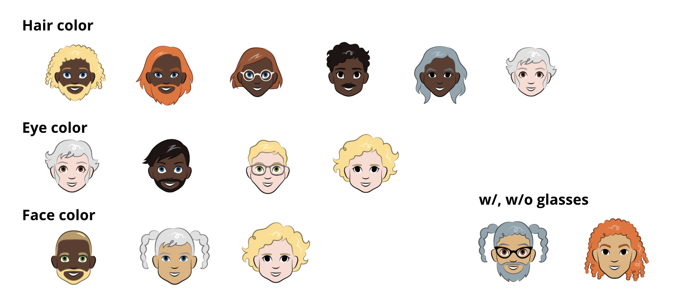
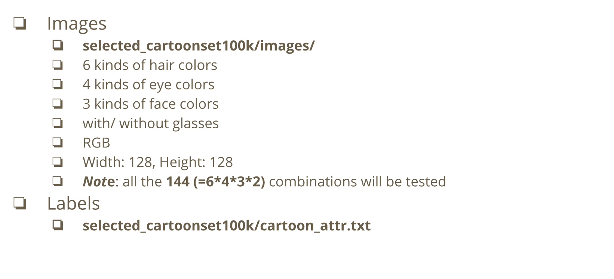
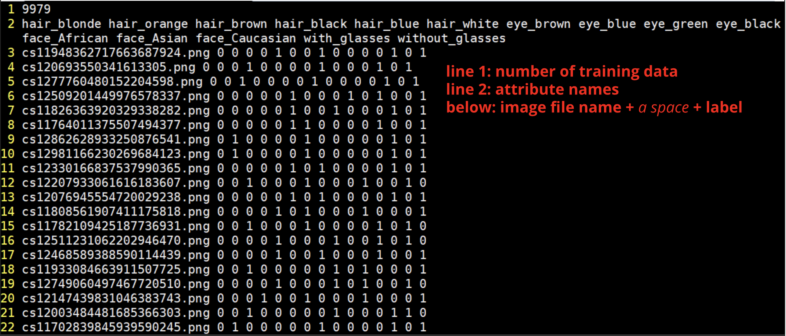
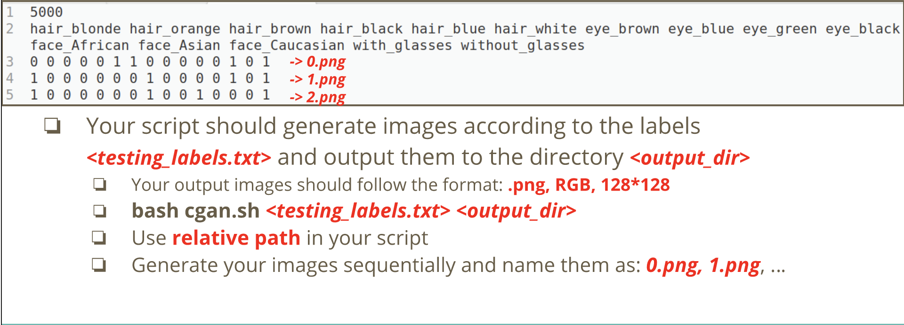
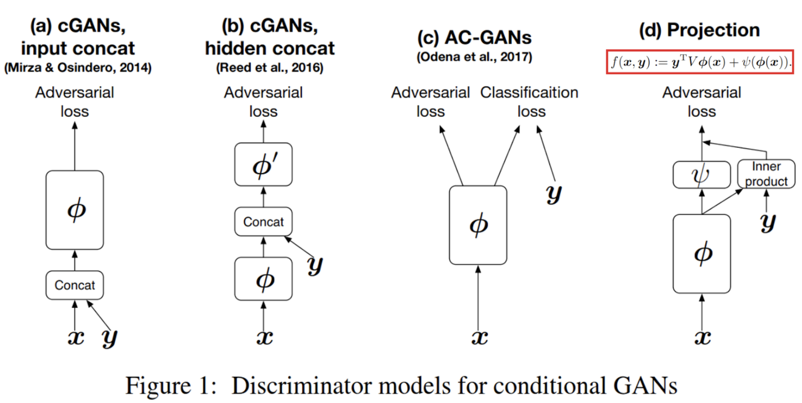
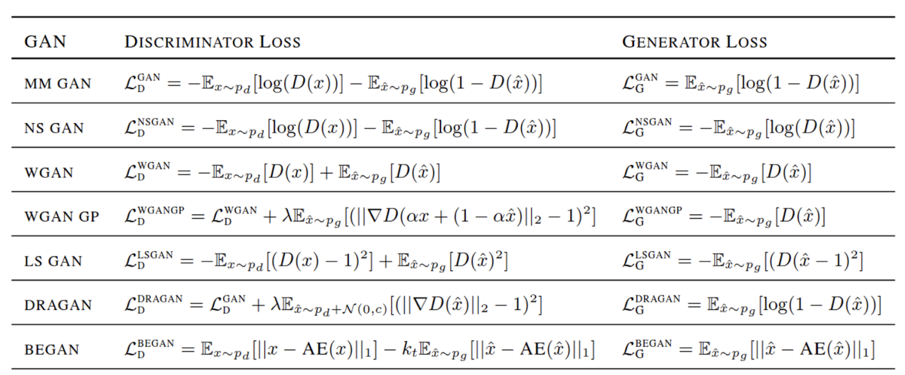

## Condition GAN

- Conditional GAN
	1. Download the **preprocessed Cartoon Set** and other resources from:
	[https://miulab.myds.me:5001/sharing/S8QcGrvzt]()
	2. The dataset is preprocessed from `cartoonset100k.tgz`, licenesed by Google LLC
	3. Using the origin dataset is allowed:[https://google.github.io/cartoonset/download.html]()
	**Note:** the original images are **500 * 500, RGBA**

- Preprocessed Cartoon set

- Data Format:
	

- Labels:

- Output Format:

## Discriminator models for CGAN
- Credit to this paper:
[https://arxiv.org/abs/1802.05637]() 
	We used different architecture for discriminator. 
	

## Loss functions
- Credit to [https://arxiv.org/pdf/1711.10337.pdf]() 
	This is the different loss functions for different models 
	
	
## How to train :
run `python3 gangangan.py --testing file [your testing file] --data_dir [the training image's directory] --label_txt [specify the path to 'cartoon_attr.txt'] --output_dir [the directory to output your generarted images] --model_dir [the directory to output your training checkpoint]`

## How to plot my figures
I used nhop while training to record the loss value. Then I transfer the data to excel and plot the graph.